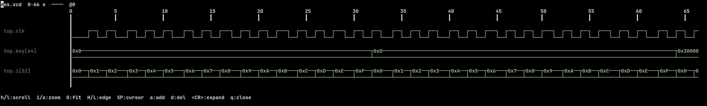

# wave.nvim

Waveform viewer for Neovim



## Requirements

- Neovim ≥ 0.12
- Rust toolchain (to compile the parser binary)

## Installation

### lazy.nvim
```lua
{
  "hikamaree/wave.nvim",
  build = "cargo build --release --manifest-path cmd/Cargo.toml",
  opts = {},
}
```

### Built-in (`vim.pack.add`)
```lua
vim.pack.add({
  { src = "https://github.com/hikamaree/wave.nvim" },
})
```

Make sure to compile the Rust binary first (see [Building](#building)).

## Setup

```lua
require("wave").setup({
  parser_binary = vim.fn.stdpath("data") .. "/wave/wave", -- default
  colors = {
    signal_hl = "String",
    cursor_hl = "Cursor",
    label_hl = "Comment",
  },
  keymaps = {
    toggle_viewer   = "<leader>wv",
    toggle_netlist  = "<leader>wn",
    add_signal      = "<leader>wa",
    remove_signal   = "<leader>wd",
    search_netlist  = "<leader>wf",
    zoom_in         = "<C-=>",
    zoom_out        = "<C-->",
    zoom_fit        = "<C-0>",
    scroll_left     = "<Left>",
    scroll_right    = "<Right>",
    marker_prev_edge = "<S-Left>",
    marker_next_edge = "<S-Right>",
  },
})
```

## Commands

| Command | Action |
|---------|--------|
| `:WaveOpen <file>` | Open waveform file |
| `:WaveToggle` | Toggle viewer |
| `:WaveNetlist` | Toggle netlist tree |
| `:WaveSearch` | Search netlist signals |
| `:WaveClose` | Close all wave windows |

VCD/FST/GHW files also open automatically via `BufReadCmd`.

## Building

```bash
cd cmd && cargo build --release
```

The binary is looked up in order: `config.parser_binary` → `stdpath("data")/wave/wave` → `$PATH` → plugin directory.
